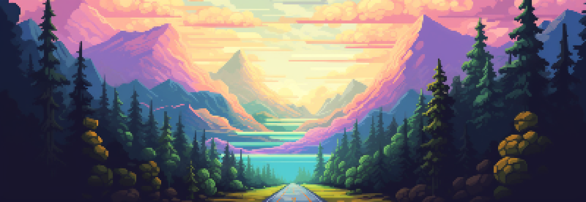

# Codédex-Style Portfolio

This project is a personal portfolio page inspired by the Codédex profile layout and adapted into a more professional single-page presentation for Bora Rotana.

## Preview

The page is built as a clean profile-style landing page with a banner header, circular avatar, project cards, timeline-style posts, and a contact section designed for freelance work and collaborations.



## Highlights

- Codédex-inspired profile layout with a more professional presentation
- Single-file implementation in `src/index.html`
- Image-based header banner and avatar
- Interactive navigation between overview, projects, posts, and contact
- Real project cards for portfolio work in this workspace
- Responsive layout for desktop and mobile

## Project Structure

```text
codedex-style-portfolio/
├── README.md
└── src/
    ├── index.html
    └── data/
        ├── Pnlu.png
        └── cover_files/
            └── banner-v2.png
```

## How It Works

The page is self-contained inside `src/index.html`.

- HTML, CSS, and JavaScript live in one file
- The avatar uses `src/data/Pnlu.png`
- The profile banner uses `src/data/cover_files/banner-v2.png`

## Sections Included

- `Overview` for summary and profile stats
- `Rank Focus` for professional direction
- `Skills` for technical stack
- `Projects` for selected work
- `Posts` for short professional updates
- `Contact` for freelance, collaboration, and remote work availability

## Open Locally

Open `src/index.html` in a browser.

If you prefer, you can also use a local static server or VS Code Live Server, but no build step is required.

## Customize

- Update profile copy in the header section
- Replace project cards in the Projects section
- Update posts in the Posts section
- Edit contact links and availability in the Contact section
- Swap the avatar or banner image by replacing the files in `src/data`

## Notes

- The design is inspired by Codédex, but the content is customized for Bora Rotana.
- The project does not require a build step or package installation.